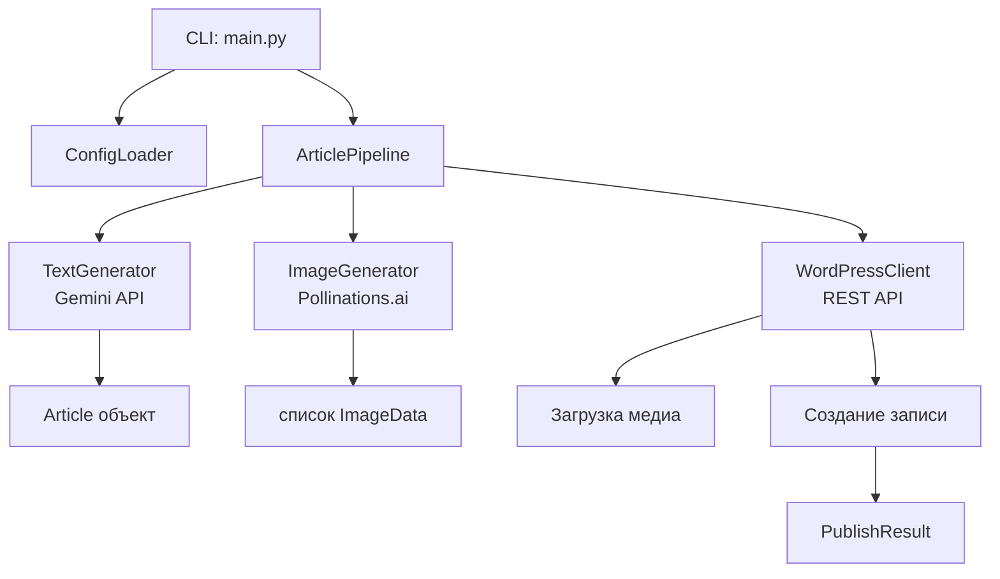

# Документ дизайна: AI Article Generator

## Обзор

Инструмент представляет собой Python CLI-приложение, которое по входящему промту:
1. Генерирует статью через бесплатный AI Text API (Google Gemini Free Tier)
2. Генерирует 2–3 изображения через бесплатный AI Image API (Pollinations.ai)
3. Загружает изображения в медиабиблиотеку WordPress
4. Публикует статью на WordPress через REST API (немедленно или по расписанию)

Выбор бесплатных API:
- Текст: **Google Gemini 1.5 Flash** (бесплатный tier: 15 RPM, 1M токенов/день) — высокое качество, не требует платёжных данных для старта
- Изображения: **Pollinations.ai** — полностью бесплатный, без ключей API, генерация через HTTP GET-запрос

---

## Архитектура



Поток выполнения:
1. CLI парсит аргументы и загружает конфигурацию
2. `ArticlePipeline` оркестрирует все шаги
3. `TextGenerator` вызывает Gemini API и возвращает `Article`
4. `ImageGenerator` вызывает Pollinations.ai и возвращает список `ImageData`
5. `WordPressClient` загружает изображения, затем создаёт запись

---

## Компоненты и интерфейсы

### ConfigLoader

Читает конфигурацию из `.env` файла и переменных окружения.

```python
class Config:
    wp_url: str           # URL WordPress сайта
    wp_username: str      # Логин WordPress
    wp_app_password: str  # Application Password WordPress
    gemini_api_key: str   # Ключ Google Gemini API
    # Pollinations.ai не требует ключа

def load_config() -> Config:
    """Загружает и валидирует конфигурацию. Бросает ConfigError если параметр отсутствует."""
```

### TextGenerator

```python
class Article:
    title: str
    body: str        # HTML или Markdown
    meta_description: str
    image_prompts: list[str]  # 2-3 промта для изображений

class TextGenerator:
    def generate(self, prompt: str) -> Article:
        """Вызывает Gemini API. Бросает TextGenerationError при ошибке API."""
```

Промт к Gemini включает инструкцию вернуть JSON с полями `title`, `body`, `meta_description`, `image_prompts`.

### ImageGenerator

```python
class ImageData:
    content: bytes
    mime_type: str   # "image/jpeg" или "image/png"
    prompt: str      # промт, использованный для генерации

class ImageGenerator:
    def generate(self, prompts: list[str]) -> list[ImageData]:
        """Генерирует изображения через Pollinations.ai.
        При ошибке одного изображения продолжает остальные.
        Бросает ImageGenerationError если все запросы провалились."""
```

URL Pollinations.ai: `https://image.pollinations.ai/prompt/{encoded_prompt}?width=1200&height=630&nologo=true`

### WordPressClient

```python
class MediaItem:
    id: int
    url: str

class PublishResult:
    post_id: int
    post_url: str
    status: str      # "publish" или "future"
    scheduled_at: Optional[datetime]

class WordPressClient:
    def upload_media(self, image: ImageData, filename: str) -> MediaItem:
        """Загружает изображение в медиабиблиотеку. Повторяет попытку 1 раз при ошибке."""

    def create_post(
        self,
        article: Article,
        media_ids: list[int],
        featured_media_id: int,
        categories: list[int],
        tags: list[str],
        publish_at: Optional[datetime]
    ) -> PublishResult:
        """Создаёт запись WordPress. Статус 'future' если publish_at задан, иначе 'publish'."""
```

### ArticlePipeline

```python
class PipelineInput:
    prompt: str
    image_count: int              # 2 или 3
    categories: list[int]
    tags: list[str]
    publish_at: Optional[datetime]

class ArticlePipeline:
    def run(self, input: PipelineInput) -> PublishResult:
        """Оркестрирует все шаги генерации и публикации."""
```

---

## Модели данных

```python
# Входные данные CLI
@dataclass
class PipelineInput:
    prompt: str
    image_count: int = 2
    categories: list[int] = field(default_factory=list)
    tags: list[str] = field(default_factory=list)
    publish_at: Optional[datetime] = None

# Сгенерированная статья
@dataclass
class Article:
    title: str
    body: str
    meta_description: str
    image_prompts: list[str]

# Данные изображения
@dataclass
class ImageData:
    content: bytes
    mime_type: str
    prompt: str

# Результат публикации
@dataclass
class PublishResult:
    post_id: int
    post_url: str
    status: str
    scheduled_at: Optional[datetime] = None
```

---

## Свойства корректности

*Свойство — это характеристика или поведение, которое должно выполняться при всех допустимых входных данных. Свойства служат мостом между читаемыми человеком спецификациями и машинно-верифицируемыми гарантиями корректности.*

Property 1: Валидация пустого промта
*Для любой* строки, состоящей только из пробельных символов (или пустой), вызов `ArticlePipeline.run` должен завершаться ошибкой валидации, не выполняя ни одного запроса к внешним API.
**Validates: Requirements 1.4**

Property 2: Количество изображений в допустимом диапазоне
*Для любого* успешного запуска пайплайна с `image_count` равным 2 или 3, количество возвращённых объектов `ImageData` должно быть не меньше 1 и не больше `image_count`.
**Validates: Requirements 2.2**

Property 3: Первое изображение становится миниатюрой
*Для любого* успешного запуска пайплайна, идентификатор `featured_media_id` в запросе к WordPress должен совпадать с `id` первого успешно загруженного медиафайла.
**Validates: Requirements 3.3**

Property 4: Статус публикации соответствует наличию даты
*Для любого* запуска пайплайна: если `publish_at` не задан — статус записи WordPress равен `publish`; если `publish_at` задан и находится в будущем — статус равен `future`.
**Validates: Requirements 5.1, 5.4**

Property 5: Дата в прошлом отклоняется
*Для любой* даты `publish_at`, которая меньше текущего момента, вызов `ArticlePipeline.run` должен завершаться ошибкой валидации, не создавая запись в WordPress.
**Validates: Requirements 5.3**

Property 6: Отсутствие обязательного параметра конфигурации вызывает ошибку
*Для любого* набора конфигурации, в котором отсутствует хотя бы один обязательный параметр (`wp_url`, `wp_username`, `wp_app_password`, `gemini_api_key`), `load_config()` должна бросать `ConfigError` с указанием имени отсутствующего параметра.
**Validates: Requirements 6.2**

Property 7: Промты изображений формируются из статьи
*Для любой* сгенерированной статьи, список `image_prompts` должен содержать от 2 до 3 непустых строк.
**Validates: Requirements 2.4**

---

## Обработка ошибок

| Ситуация | Исключение | Поведение |
|---|---|---|
| Пустой промт | `ValidationError` | Немедленный выход, код 1 |
| Дата в прошлом | `ValidationError` | Немедленный выход, код 1 |
| Отсутствует параметр конфига | `ConfigError` | Немедленный выход, код 1 |
| Ошибка Gemini API | `TextGenerationError` | Вывод ошибки, код 1 |
| Ошибка одного изображения | Предупреждение | Продолжение с оставшимися |
| Все изображения провалились | `ImageGenerationError` | Выход, код 1 |
| Ошибка загрузки медиа в WP | Повтор 1 раз, затем `WordPressError` | Выход, код 1 |
| Ошибка аутентификации WP | `WordPressAuthError` | Вывод подсказки, код 1 |

---

## Стратегия тестирования

### Двойной подход

Используются два вида тестов, которые дополняют друг друга:

- **Unit-тесты** — проверяют конкретные примеры, граничные случаи и обработку ошибок с моками внешних API
- **Property-тесты** — проверяют универсальные свойства на множестве сгенерированных входных данных

### Библиотека для property-based тестирования

**Hypothesis** (Python) — зрелая библиотека, поддерживает стратегии генерации данных, shrinking, воспроизведение падений.

Установка: `pip install hypothesis`

### Конфигурация property-тестов

- Минимум 100 итераций на каждый тест (`@settings(max_examples=100)`)
- Каждый тест аннотирован комментарием: `# Feature: ai-article-generator, Property N: <текст>`
- Каждое свойство из раздела "Свойства корректности" реализуется одним property-тестом

### Unit-тесты охватывают

- Парсинг ответа Gemini (корректный JSON, некорректный JSON, неполные поля)
- Формирование URL Pollinations.ai (спецсимволы в промте, длинные промты)
- Валидацию конфигурации (каждый обязательный параметр по отдельности)
- Формирование тела запроса к WordPress REST API
- Логику повтора при ошибке загрузки медиа

### Внешние зависимости в тестах

Все HTTP-запросы к внешним API мокируются через `unittest.mock` или `responses` библиотеку. Реальные API не вызываются в тестах.
