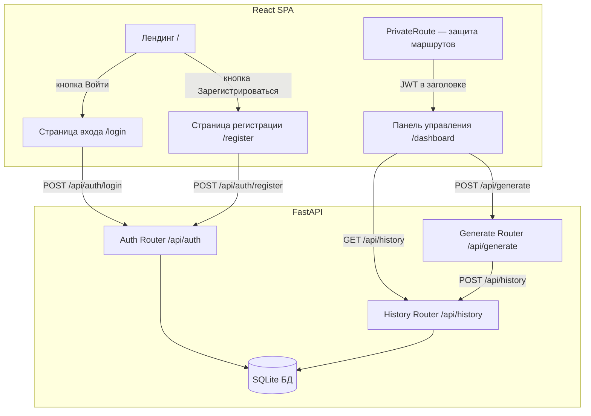
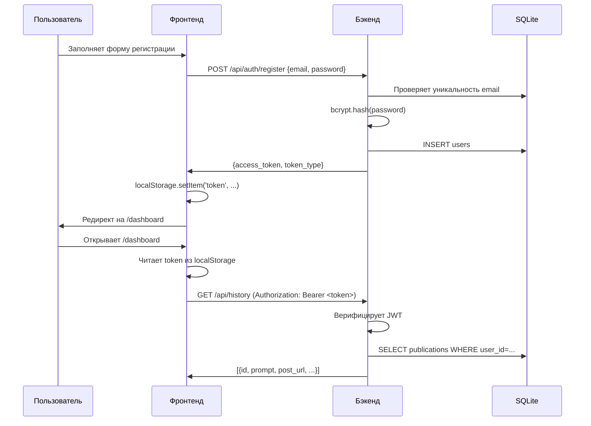

# Дизайн: Система авторизации и лендинг

## Обзор

Добавляем к существующему AI Article Generator:
- Публичный лендинг (главная страница)
- Страницы входа и регистрации
- JWT-авторизацию на бэкенде (FastAPI)
- Защищённые маршруты на фронтенде (React Router)
- Перенос истории публикаций из localStorage в SQLite через SQLAlchemy

Технический стек остаётся прежним: Python FastAPI + React + Vite + TypeScript + Tailwind. Добавляем: `python-jose` (JWT), `passlib[bcrypt]` (хэширование), `sqlalchemy` (ORM), `react-router-dom` (маршрутизация).

---

## Архитектура



### Поток авторизации



---

## Компоненты и интерфейсы

### Бэкенд

#### Структура файлов

```
web/backend/
├── api.py              # существующий, добавляем include_router
├── database.py         # новый: SQLAlchemy engine, SessionLocal, Base
├── models.py           # новый: ORM-модели User, Publication
├── schemas.py          # новый: Pydantic-схемы для запросов/ответов
├── auth.py             # новый: JWT-утилиты, зависимость get_current_user
├── routers/
│   ├── auth_router.py      # новый: /api/auth/register, /api/auth/login
│   └── history_router.py   # новый: /api/history GET, DELETE
```

#### Auth Router — эндпоинты

| Метод | Путь | Описание |
|-------|------|----------|
| POST | `/api/auth/register` | Регистрация нового пользователя |
| POST | `/api/auth/login` | Вход, возвращает JWT |

#### History Router — эндпоинты

| Метод | Путь | Описание |
|-------|------|----------|
| GET | `/api/history` | Получить историю текущего пользователя |
| POST | `/api/history` | Добавить запись (вызывается из /api/generate) |
| DELETE | `/api/history` | Удалить всю историю текущего пользователя |

#### Зависимость авторизации

```python
# auth.py
async def get_current_user(
    token: str = Depends(oauth2_scheme),
    db: Session = Depends(get_db)
) -> User:
    # Декодирует JWT, находит пользователя в БД
    # Бросает HTTPException(401) при невалидном токене
```

### Фронтенд

#### Структура файлов

```
web/frontend/src/
├── App.tsx                  # обновить: добавить React Router
├── api.ts                   # обновить: добавить auth/history функции
├── auth.ts                  # новый: утилиты работы с токеном
├── types.ts                 # обновить: добавить AuthUser, LoginRequest и др.
├── pages/
│   ├── LandingPage.tsx      # новый: лендинг
│   ├── LoginPage.tsx        # новый: форма входа
│   └── RegisterPage.tsx     # новый: форма регистрации
└── components/
    ├── PrivateRoute.tsx      # новый: защита маршрутов
    ├── HistoryTab.tsx        # обновить: загрузка из API вместо localStorage
    └── Sidebar.tsx           # обновить: добавить кнопку выхода
```

#### Компонент PrivateRoute

```tsx
// Проверяет наличие токена в localStorage
// Если токен отсутствует — редирект на /login
// Если токен есть — рендерит дочерний компонент
function PrivateRoute({ children }: { children: ReactNode }) {
  const token = localStorage.getItem('token');
  return token ? children : <Navigate to="/login" replace />;
}
```

#### Маршрутизация (React Router)

```
/           → LandingPage (публичный)
/login      → LoginPage (публичный, редирект на /dashboard если авторизован)
/register   → RegisterPage (публичный, редирект на /dashboard если авторизован)
/dashboard  → App (защищённый через PrivateRoute)
```

---

## Модели данных

### ORM-модели (SQLAlchemy)

```python
class User(Base):
    __tablename__ = "users"
    id: int (PK, autoincrement)
    email: str (unique, indexed)
    hashed_password: str
    created_at: datetime (default=now)

class Publication(Base):
    __tablename__ = "publications"
    id: int (PK, autoincrement)
    user_id: int (FK → users.id, cascade delete)
    prompt: str
    post_url: str
    status: str
    wp_url: str
    created_at: datetime (default=now)
```

### Pydantic-схемы

```python
# Запросы
class RegisterRequest(BaseModel):
    email: EmailStr
    password: str  # min_length=8

class LoginRequest(BaseModel):
    email: EmailStr
    password: str

# Ответы
class TokenResponse(BaseModel):
    access_token: str
    token_type: str = "bearer"

class PublicationOut(BaseModel):
    id: int
    prompt: str
    post_url: str
    status: str
    wp_url: str
    created_at: datetime
```

### TypeScript-типы

```typescript
interface LoginRequest { email: string; password: string; }
interface RegisterRequest { email: string; password: string; }
interface TokenResponse { access_token: string; token_type: string; }
interface PublicationRecord {
  id: number;
  prompt: string;
  post_url: string;
  status: string;
  wp_url: string;
  created_at: string;
}
```

---

## Свойства корректности

*Свойство — это характеристика или поведение, которое должно выполняться для всех допустимых входных данных системы. Свойства служат мостом между читаемыми человеком спецификациями и машинно-верифицируемыми гарантиями корректности.*


### Свойство 1: Регистрация с валидными данными всегда возвращает токен

*Для любых* валидных email и пароля длиной ≥ 8 символов, запрос на регистрацию должен возвращать HTTP 200 и объект с полем `access_token`.

**Validates: Requirements 2.1**

---

### Свойство 2: Дублирующийся email всегда возвращает 409

*Для любого* email, уже зарегистрированного в системе, повторная попытка регистрации должна возвращать HTTP 409.

**Validates: Requirements 2.2**

---

### Свойство 3: Короткий пароль всегда возвращает 422

*Для любой* строки пароля длиной от 0 до 7 символов включительно, запрос на регистрацию должен возвращать HTTP 422.

**Validates: Requirements 2.3**

---

### Свойство 4: Невалидные учётные данные при входе всегда возвращают 401

*Для любой* комбинации email/пароль, не совпадающей с зарегистрированными данными (несуществующий email или неверный пароль), запрос на вход должен возвращать HTTP 401.

**Validates: Requirements 3.2, 3.3**

---

### Свойство 5: Round-trip авторизации — регистрация → вход → доступ к защищённому ресурсу

*Для любых* валидных email и пароля: после регистрации, последующий вход с теми же данными должен вернуть токен, а запрос к защищённому эндпоинту с этим токеном должен вернуть HTTP 200.

**Validates: Requirements 3.1, 4.3**

---

### Свойство 6: Невалидный токен всегда возвращает 401

*Для любой* строки, не являющейся валидным JWT-токеном системы (случайная строка, истёкший токен, токен с неверной подписью), запрос к любому защищённому эндпоинту должен возвращать HTTP 401.

**Validates: Requirements 4.2**

---

### Свойство 7: Срок действия JWT-токена — 7 дней

*Для любого* токена, выданного системой, декодированное поле `exp` должно быть равно времени выдачи плюс 7 дней (604800 секунд) с допуском ±5 секунд.

**Validates: Requirements 4.4**

---

### Свойство 8: Изоляция истории публикаций между пользователями

*Для любых* двух разных пользователей с непересекающимися наборами публикаций, запрос истории каждого пользователя должен возвращать только его собственные записи и не содержать записей другого пользователя.

**Validates: Requirements 5.2**

---

### Свойство 9: Удаление истории не затрагивает других пользователей

*Для любых* двух пользователей, у каждого из которых есть записи в истории, удаление истории одного пользователя не должно изменять количество записей другого пользователя.

**Validates: Requirements 5.3**

---

### Свойство 10: История отсортирована по дате убывания

*Для любого* набора публикаций пользователя, возвращаемый список должен быть отсортирован так, что `created_at[i] >= created_at[i+1]` для всех соседних элементов.

**Validates: Requirements 5.4**

---

### Свойство 11: Хэш пароля использует bcrypt с cost-фактором ≥ 12

*Для любого* пароля, сохранённого в БД, поле `hashed_password` должно начинаться с `$2b$12$` (bcrypt, cost 12).

**Validates: Requirements 6.4**

---

## Обработка ошибок

| Ситуация | HTTP-статус | Описание |
|----------|-------------|----------|
| Дублирующийся email при регистрации | 409 Conflict | `{"detail": "Email already registered"}` |
| Неверные учётные данные при входе | 401 Unauthorized | `{"detail": "Invalid credentials"}` |
| Невалидный/истёкший JWT | 401 Unauthorized | `{"detail": "Could not validate credentials"}` |
| Невалидные данные формы (email, пароль) | 422 Unprocessable Entity | Стандартный ответ FastAPI с деталями валидации |
| Ошибка БД | 500 Internal Server Error | `{"detail": "Internal server error"}` |

На фронтенде все ошибки API отображаются в компоненте `ErrorPanel` (уже существует). При получении 401 от любого защищённого эндпоинта — автоматический редирект на `/login` с очисткой токена.

---

## Стратегия тестирования

### Двойной подход

Используем **pytest** для бэкенда и **Vitest** для фронтенда.

Для property-based тестирования бэкенда используем **Hypothesis** (уже используется в проекте — см. `tests/test_*_property.py`).

### Unit-тесты (конкретные примеры)

- Проверка схемы БД (наличие таблиц и колонок)
- Проверка редиректа лендинга для авторизованного пользователя
- Проверка редиректа `/dashboard` без токена на `/login`
- Проверка успешного входа и сохранения токена в localStorage
- Проверка выхода и очистки токена

### Property-based тесты (Hypothesis)

Каждое свойство реализуется одним property-based тестом с минимум 100 итерациями.

Конфигурация тегов:
```python
# Feature: user-auth-landing, Property N: <текст свойства>
@settings(max_examples=100)
@given(...)
def test_property_N_...():
    ...
```

| Свойство | Тест | Библиотека |
|----------|------|------------|
| Свойство 1: Регистрация с валидными данными | `test_register_valid_returns_token` | Hypothesis |
| Свойство 2: Дублирующийся email → 409 | `test_duplicate_email_returns_409` | Hypothesis |
| Свойство 3: Короткий пароль → 422 | `test_short_password_returns_422` | Hypothesis |
| Свойство 4: Невалидные учётные данные → 401 | `test_invalid_credentials_returns_401` | Hypothesis |
| Свойство 5: Round-trip авторизации | `test_auth_roundtrip` | Hypothesis |
| Свойство 6: Невалидный токен → 401 | `test_invalid_token_returns_401` | Hypothesis |
| Свойство 7: Срок действия токена 7 дней | `test_token_expiry_7_days` | Hypothesis |
| Свойство 8: Изоляция истории | `test_history_isolation` | Hypothesis |
| Свойство 9: Удаление не затрагивает других | `test_delete_history_isolation` | Hypothesis |
| Свойство 10: История отсортирована | `test_history_sorted_desc` | Hypothesis |
| Свойство 11: bcrypt cost ≥ 12 | `test_password_hash_bcrypt_cost` | Hypothesis |

### Баланс тестов

- Unit-тесты: конкретные примеры, граничные случаи, интеграционные точки
- Property-тесты: универсальные свойства через рандомизацию
- Не дублируем покрытие: property-тесты заменяют множество однотипных unit-тестов
